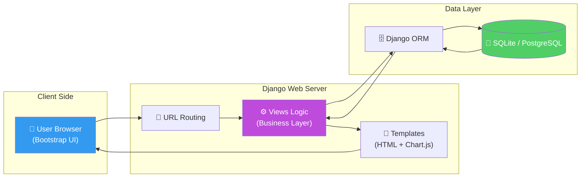
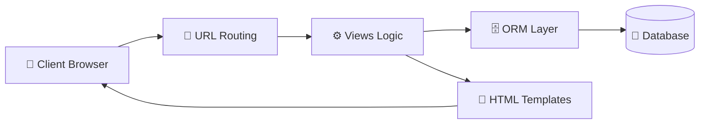

# 📋 DailyTrack: Full-Stack Productivity Engineering & Web Systems

<p align="center">
  
  
  
  
  
</p>

**DailyTrack** è una piattaforma web full-stack progettata per l'ottimizzazione della produttività individuale e il tracciamento operativo dei task. Sviluppata utilizzando il framework **Django**, l'applicazione implementa un'architettura **MVT (Model-View-Template)** robusta, integrando logiche di autenticazione sicura, persistenza dei dati via ORM e visualizzazioni analitiche in tempo reale, dimostrando la capacità di consegnare prodotti web completi e pronti per la produzione.

## 🏢 Valore Enterprise & Settori di Applicazione

| Settore / Ambito | Rilevanza & Benefici |
|-------------------|-----------|
| **Enterprise Internal Tools** | Sviluppo di portali per la gestione dei workflow interni, tracciamento delle attività dei team e reporting di progetto. |
| **Productivity Tech** | Creazione di soluzioni SaaS (Software as a Service) per il time-management e il monitoraggio degli obiettivi (OKR). |
| **Data Products UI** | Implementazione di interfacce web per il controllo di pipeline dati, visualizzazione di KPI e interazione con dataset complessi. |
| **Human Resources (HR)** | Strumenti di self-reporting per dipendenti e monitoraggio del carico di lavoro bilanciato. |

---

## 🎯 Executive Summary & Valore di Business
DailyTrack trasforma il concetto di "to-do list" in uno strumento di analisi della produttività, fornendo insight quantitativi sull'efficienza operativa.

### 🏛️ 1. Ingegneria Web & Architettura MVT
* **Django ORM & Model Design:** Modellazione dei dati efficiente con l'uso dell'ORM di Django, garantendo l'indipendenza dal database e una gestione semplificata delle migrazioni e delle relazioni tra entità (User vs Task).
* **Secure Authentication:** Implementazione di un sistema di gestione utenti completo (registrazione, login, logout) basato sul modulo `auth` di Django, integrando best-practice di sicurezza come la protezione CSRF e il password hashing.

### ⚙️ 2. Business Logic & Analytics
* **KPI Engine:** Calcolo dinamico della percentuale di completamento giornaliera e settimanale attraverso logiche implementate nel layer delle View, fornendo un feedback immediato sull'andamento degli obiettivi.
* **Data Visualization (Chart.js):** Integrazione di librerie JavaScript per la generazione di grafici interattivi che mostrano il trend della produttività, facilitando l'identificazione di pattern di efficienza o colli di bottiglia.

### 🛡️ 3. User Experience & Professional UI
* **Responsive Design (Bootstrap 5):** Interfaccia utente moderna e adattiva, ottimizzata per l'uso sia su desktop che su dispositivi mobile, garantendo un'accessibilità fluida in ogni contesto lavorativo.
* **Admin Dashboard:** Sfruttamento dell'interfaccia amministrativa nativa di Django per la gestione centralizzata di utenti, task e permessi, riducendo i tempi di sviluppo del back-office.

---

## 🏗️ Architettura del Sistema (MVT Flow)



## 🛠️ Stack Tecnologico

| Layer | Tecnologia | Ruolo |
|:------|:-----------|:-----|
| 🐍 **Backend** | Python 3.10+ / Django 4.x | Core Web Framework |
| 🎨 **Frontend** | Bootstrap 5 / HTML5 | Responsive UI Design |
| 📊 **Charts** | Chart.js | Interactive Productivity Plots |
| 🗄️ **Database** | SQLite (dev) / ORM | Data Persistence |
| 🔐 **Security** | Django Auth / CSRF | User Security & Compliance |

## 🚀 Setup & Esecuzione

```bash
# Clone e navigazione
git clone https://github.com/sylver86/19-daily-task-tracker-django.git
cd 19-daily-task-tracker-django

# Ambiente Virtuale
python -m venv venv
source venv/bin/activate

# Inizializzazione Database e Admin
python manage.py migrate
python manage.py createsuperuser

# Avvio Server
python manage.py runserver
```

<br><br>

*Progettato e sviluppato da Eugenio Pasqua.*

---

# 🇬🇧 ENGLISH VERSION

# 📋 DailyTrack: Full-Stack Productivity Engineering & Web Systems

<p align="center">
  
  
</p>

**DailyTrack** is a full-stack web platform designed for optimizing individual productivity and operational task tracking. Built using the **Django** framework, the application implements a robust **MVT (Model-View-Template)** architecture, integrating secure authentication, ORM data persistence, and real-time analytical visualizations.

## 🏢 Enterprise Value & Application Sectors

| Sector / Domain | Relevance & Benefits |
|-------------------|-----------|
| **Internal Tools** | Developing project tracking portals and internal workflow management systems. |
| **SaaS & Tech** | Scalable foundation for time-management and OKR tracking solutions. |
| **Data Products UI** | Creating web interfaces for data pipeline monitoring and KPI visualization. |

---

## 🏗️ System Architecture (MVT Flow)



## 🧰 Technology Stack

`Python 3.10+` · `Django 4.x` · `SQLite` · `Bootstrap 5` · `Chart.js` · `Django ORM`

<br><br>

*Designed and developed by Eugenio Pasqua.*
